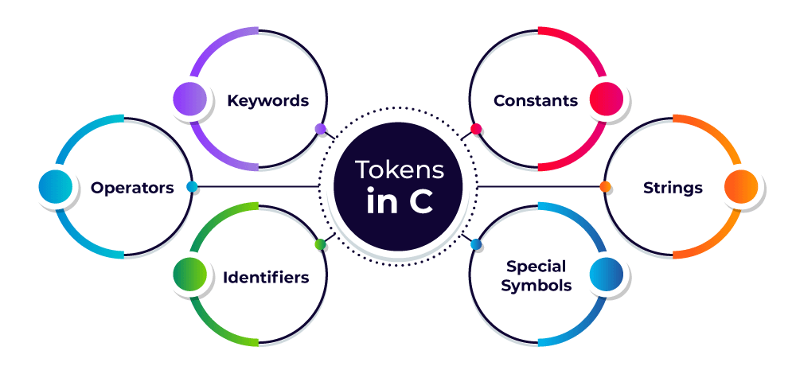

## Tokens in C

A token in C can be defined as the smallest individual element of the C programming language that is meaningful to the compiler. It is the basic component of a C program.

## Types of Tokens in C

The tokens of C language can be classified into six types based on the functions they are used to perform. The types of C tokens are as follows:



1. Keywords

    The keywords are pre-defined or reserved words in a programming language. Each keyword is meant to perform a specific function in a program. Since keywords are referred names for a compiler, they can’t be used as variable names because by doing so, we are trying to assign a new meaning to the keyword which is not allowed. You cannot redefine keywords. However, you can specify the text to be substituted for keywords before compilation by using C preprocessor directives. **Depending on the C standard, the number of keywords may vary.**

2. Identifiers

    Identifiers are used as the general terminology for the naming of variables, functions, and arrays. These are user-defined names consisting of an arbitrarily long sequence of letters and digits with either a letter or the underscore(_) as a first character. Identifier names must differ in spelling and case from any keywords. You cannot use keywords as identifiers; they are reserved for special use. Once declared, you can use the identifier in later program statements to refer to the associated value. A special identifier called a statement label can be used in goto statements. 

    Certain rules should be followed while naming c identifiers which are as follows:

        - They must begin with a letter or underscore(_).
        - They must consist of only letters, digits, or underscore. No other special character is allowed.
        - It should not be a keyword.
        - It must not contain white space.
        - It should be up to 31 characters long as only the first 31 characters are significant.

    **Note**: *Identifiers are case-sensitive so names like variable and Variable will be treated as different.*

3. Constants

    The constants refer to the variables with fixed values. They are like normal variables but with the difference that their values can not be modified in the program once they are defined. 

    Constants may belong to any of the data types.

    ```c
    const int CONST = 5;
    ```

4. Strings

    Strings are nothing but an array of characters ended with a null character (‘\0’). This null character indicates the end of the string. Strings are always enclosed in double quotes. Whereas, a character is enclosed in single quotes in C and C++.

    ```c
    char string[20] = {'h', 'e', 'l', 'l', 'o', 'w', 'o', 'r', 'l', 'd', '\0'};
    char string[20] = "helloworld";
    char string[] = "helloworld";
    ```

5. Special Symbols

    The following special symbols are used in C having some special meaning and thus, cannot be used for some other purpose. Some of these are listed below:

    - **Brackets[]**: Opening and closing brackets are used as array element references. These indicate single and multidimensional subscripts.

    - **Parentheses()**: These special symbols are used to indicate function calls and function parameters.

    - **Braces{}**: These opening and ending curly braces mark the start and end of a block of code containing more than one executable statement.

    - **Comma(, )**: It is used to separate more than one statement like for separating parameters in function calls.

    - **Colon(:)**: It is an operator that essentially invokes something called an initialization list.

    - **Semicolon(;)**: It is known as a statement terminator. It indicates the end of one logical entity. That’s why each individual statement must be ended with a semicolon.

    - **Asterisk (*)**: It is used to create a pointer variable and for the multiplication of variables.

    - **Assignment operator(=)**: It is used to assign values and for logical operation validation.

    - **Pre-processor (#)**: The preprocessor is a macro processor that is used automatically by the compiler to transform your program before actual compilation.

    - **Period (.)**: Used to access members of a structure or union.

    - **Tilde(~)**: [Bitwise](https://en.wikipedia.org/wiki/Bitwise_operation#NOT) One’s Complement Operator.

6. Operators

    Operators are symbols that trigger an action when applied to C variables and other objects. The data items on which operators act are called operands. 

    Depending on the number of operands that an operator can act upon, operators can be classified as follows: 

    - **Unary Operators**: Those operators that require only a single operand to act upon are known as unary operators. For example, increment and decrement operators

    - **Binary Operators**: Those operators that require two operands to act upon are called binary operators. Binary operators can further be classified into: 

            1. Arithmetic Operators

            2. Relational Operators

            3. Logical Operators

            4. Assignment Operators

            5. Bitwise Operator

    - **Ternary Operator**: The operator that requires three operands to act upon is called the ternary operator. Conditional Operator(?) is also called the ternary operator.

