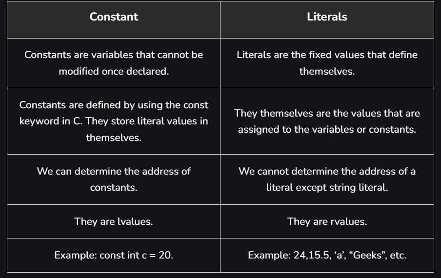

## Constants in C

## Constants vs Literals



## Defining Constant using #define preprocessor

We can also define a constant in C using #define preprocessor. The constants defined using #define are macros that behave like a constant. These constants are not handled by the compiler, they are handled by the preprocessor and are replaced by their value before compilation.

Syntax:
```c
#define const_name value
```

```C
#include <stdio.h>
#define pi 3.14
 
int main()
{
 
    printf("The value of pi: %.2f", pi);
    return 0;
}
```

**Note:** *This method for defining constant is not preferred as it may introduce bugs and make the code difficult to maintain.*