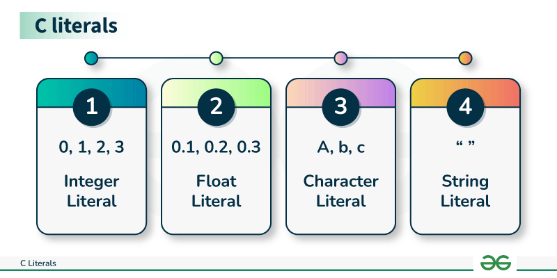

## Literals in C

In C, Literals are the constant values that are assigned to the variables. Literals represent fixed values that cannot be modified. Literals contain memory but they do not have references as variables. Generally, both terms, constants, and literals are used interchangeably. 
For example, “const int = 5;“, is a constant expression and the value 5 is referred to as a constant integer literal.

## Types of C Literals

There are 4 types of literal in C:
- Integer Literal
- Float Literal
- Character Literal
- String Literal



## Integer Literals

Integer literals are used to represent and store the integer values only. Integer literals are expressed in two types i.e.

A) **Prefixes:** The Prefix of the integer literal indicates the base in which it is to be read.

For Example: `0x10 = 16` Because `0x` prefix represents a HexaDecimal base. So 10 in HexaDecimal is 16 in Decimal. Hence the value 16.

They are basically represented into 4 types:

- a. **Decimal-Literal(base 10):** A non-zero decimal digit followed by zero or more decimal digits(0, 1, 2, 3, 4, 5, 6, 7, 8, 9).

Example: `56`, `78`

- b. **Octal-literal(base 8):** a 0 followed by zero or more octal digits(0, 1, 2, 3, 4, 5, 6, 7).

Example: `045`, `076`, `06120`

- c. **Hex-literal(base 16):** 0x or 0X followed by one or more hexadecimal digits(0, 1, 2, 3, 4, 5, 6, 7, 8, 9, a, A, b, B, c, C, d, D, e, E, f, F).

Example: `0x23A`, `0Xb4C`, `0xFEA`

- d. **Binary-literal(base 2):** 0b or 0B followed by one or more binary digits(0, 1).

Example: `0b101`, `0b111`

```c
#include <stdio.h>

int main()
{
    int inDecimal = 33;
    printf("Decimal Integer: %d\n", inDecimal); // 33

    int inOctal = 045;
    printf("Octal Integer: %d\n", inOctal); // 37

    int inHexaDecimal = 0x23A;
    printf("Hexadecimal Integer: %d\n", inHexaDecimal); // 570

    int inBinary = 0b101;
    printf("Integer In Binary: %d\n", inBinary); // 5

    return 0;
}
```

B) **Suffixes:** The Suffix of the integer literal indicates the type in which it is to be read.

For example: `12345678901234LL` indicates a long long integer value 12345678901234 because of the suffix LL 

These are represented in many ways according to their data types.

- **int:** No suffix is required because integer constant is by default assigned as an int data type.
- **unsigned int:** character u or U at the end of an integer constant.
- **long int:** character l or L at the end of an integer constant.
- **unsigned long int:** character ul or UL at the end of an integer constant.
- **long long int:** character ll or LL at the end of an integer constant.
- **unsigned long long int:** character ull or ULL at the end of an integer constant.

## 2. Floating-Point Literals

These are used to represent and store real numbers. The real number has an integer part, real part, fractional part, and exponential part. The floating-point literals can be stored either in decimal form or exponential form. While representing the floating-point decimals one must keep two things in mind to produce valid literal:

- In the decimal form, one must include the integer part, or fractional part, or both, otherwise, it will lead to an error.

- In the exponential form, one must include both the significand and exponent part, otherwise, it will lead to an error.

A few floating-point literal representations are shown below:

**Valid Floating Literals:**
```
10.125
1.215e-10L
10.5E-3
```

**Invalid Floating Literals:**
```
123E
1250f
0.e879
```

```c
#include <stdio.h>
 
int main()
{
    // constant float literal
    const float floatVal = 4.14;
 
    printf("Floating point literal: %.2f\n",
        floatVal);
    return 0;
}
```

Output:
```bash
Floating point literal: 4.14
```

## Character Literals

This refers to the literal that is used to store a single character within a single quote. To store multiple characters, one needs to use a character array. Storing more than one character within a single quote will throw a warning and display just the last character of the literal. It gives rise to the following two representations:

- **char type:** This is used to store normal character literal or narrow-character literals.

Example: `char chr = 'G';`

```c
#include <stdio.h>
 
int main()
{
    // constant char literal
    const char charVal = 'A';
 
    printf("Character Literal: %c\n",
        charVal);
    return 0;
}
```

Output:
```bash
Character Literal: A
```

- **Escape Sequences:** There are various special characters that one can use to perform various operations.

## String Literals

String literals are similar to that character literals, except that they can store multiple characters and uses a double quote to store the same. It can also accommodate the special characters and escape sequences mentioned in the table above. We can break a long line into multiple lines using string literal and can separate them with the help of white spaces.

Example: `char stringVal[] = "SomeText";

```c
#include <stdio.h>

int main()
{
    const char str[] = "Welcome\nTo\Geeks\tFor\tGeeks";
    printf("%s", str);
    return 0;
}
```

Output
```
Welcome
To
Geeks   For     Geeks
```