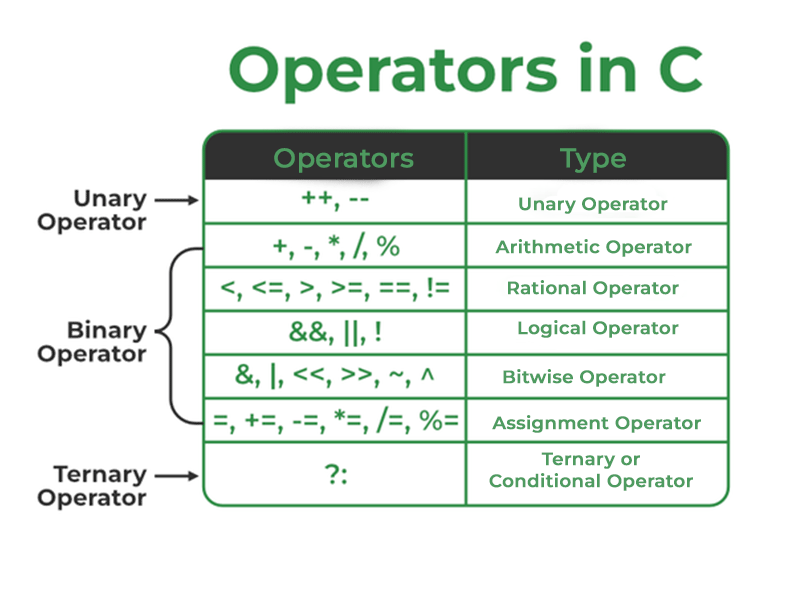
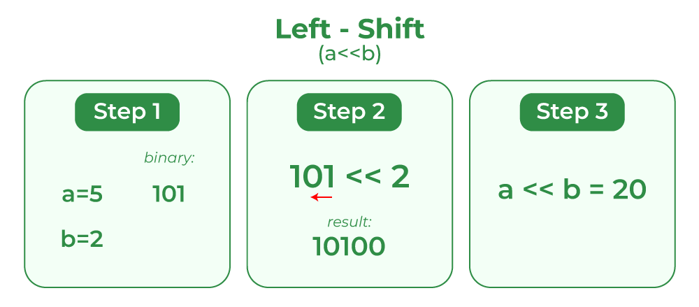
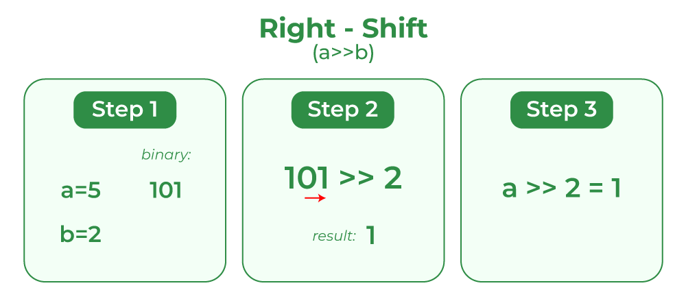

## Operators in C

In C language, operators are symbols that represent operations to be performed on one or more operands.

## What is a C Operator?

An operator in C can be defined as the symbol that helps us to perform some specific mathematical, relational, bitwise, conditional, or logical computations on values and variables. The values and variables used with operators are called operands. So we can say that the operators are the symbols that perform operations on operands.



For example
```c
c = a + b;;
```

Here, `+` is the operator known as the addition operator, and `a` and `b` are operands. The addition operator tells the compiler to add both of the operands `a` and `b`.

## Types of Operators in C

C language provides a wide range of operators that can be classified into 6 types based on their functionality:

1. Arithmetic Operators

2. Relational Operators

3. Logical Operators

4. Bitwise Operators

5. Assignment Operators

6. Other Operators

## Arithmetic Operators in C

The arithmetic operators are used to perform arithmetic/mathematical operations on operands. There are 9 arithmetic operators in C language:

- `+` (Plus) - Adds two numeric values - `a + b`

- `-` (Minus) - Subtracts right operand from left operand - `a - b`

- `*` (Multiply) - Multiplies two numeric values - `a * b`

- `/` (Divide) - Divide two numeric values - `a / b`

- `%` (Modulus) - Returns the remainder after dividing the left operand with the right operand - `a % b`

- `+` (Unary Plus) - Used to specify the positive values - `+a`

- `-` (Unary Minus) - Flips the sign of the value - `-a`

- `++` (Increment) - Increases the value of the operand by 1 - `a++`

- `--` (Decrement) - Decreases the value of the operand by 1 - `a--`

```c
#include <stdio.h>

int main()
{
    int a = 25, b = 5;
    printf("a + b = %d\n", a + b);
    printf("a - b = %d\n", a - b);
    printf("a * b = %d\n", a * b);
    printf("a / b = %d\n", a / b);
    printf("a %% b = %d\n", a % b);
    printf("+a = %d\n", +a);
    printf("-a = %d\n", -a);
    printf("a++ = %d\n", a++);
    printf("a-- = %d", a--);

    return 0;
}
```

Output
```
a + b = 30
a - b = 20
a * b = 125
a / b = 5
a % b = 0
+a = 25
-a = -25
a++ = 25
a-- = 26
```

## Relational Operators in C

The relational operators in C are used for the comparison of the two operands. All these operators are binary operators that return true or false values as the result of comparison.

These are a total of 6 relational operators in C:

- `<` (Less than) - Returns true if the left operand is less than the right operand. Else false - `a < b`

- `>` (Greater than) - Returns true if the left operand is greater than the right operand. Else false - `a > b`

- `<=` (Less than or equal to) - Returns true if the left operand is less than or equal to the right operand. Else false - `a <= b`

- `>=` (Greater than or equal to) - Returns true if the left operand is greater or equal to the right operand. Else false - `a >= b`

- `==` (Equal to) - Returns true if both the operands are equal. Else false - `a == b`

- `!=` (Not equal to) - Returns true if both the operands are not equal. Else false - `a != b`

```c
#include <stdio.h>

int main()
{

    int a = 25, b = 5;

    printf("a < b is %d\n", a < b);
    printf("a > b is %d\n", a > b);
    printf("a <= b is %d\n", a <= b);
    printf("a >= b is %d\n", a >= b);
    printf("a == b is %d\n", a == b);
    printf("a != b is %d", a != b);

    return 0;
}
```

Output
```
a < b is 0
a > b is 1
a <= b is 0
a >= b is 1
a == b is 0
a != b is 1
```

## Logical Operators in C

Logical Operators are used to combine two or more conditions/constraints or to complement the evaluation of the original condition in consideration. The result of the operation of a logical operator is a Boolean value either true or false.

- `&&` (Logical AND) - Returns true if both the operands are true - `a && b`

- `||` (Logical OR) - Returns true if both or any of the operands is true - `a || b`

- `!` - (Logical NOT) - Returns true if the operand is false - `!a`

```c
#include <stdio.h>
#include <stdbool.h>

int main()
{

    bool a = true, b = false, c = true;

    printf("%d\n", a && b);        // false(0)
    printf("%d\n", (a && b) || c); // true(1) - would do the same if `a && b || c`
    printf("%d\n", a || b);        // true(1)
    printf("%d\n", !b);            // true(1)
    printf("%d\n", !!a);           // true(1)
    printf("%d", !c);              // false(0)

    return 0;
}
```

Output
```
0
1
1
1
1
0
```

## Bitwise Operators in C

The Bitwise operators are used to perform bit-level operations on the operands. The operators are first converted to bit-level and then the calculation is performed on the operands. Mathematical operations such as addition, subtraction, multiplication, etc. can be performed at the bit level for faster processing.

There are 6 bitwise operators in C:

- `&` (Bitwise AND) - Performs bit-by-bit AND operation and returns the result - `a & b`

    **NOTE:** *The bitwise AND operator ( & ) compares each bit of the first operand to the corresponding bit of the second operand. If both bits are 1, the corresponding result bit is set to 1. Otherwise, the corresponding result bit is set to 0.*

- `|` (Bitwise OR) - Performs bit-by-bit OR operation and returns the result - `a | b`

    **NOTE:** *A bitwise OR is a binary operation that takes two bit patterns of equal length and performs the logical `inclusive` OR operation on each pair of corresponding bits. The result in each position is 0 if both bits are 0, while otherwise the result is 1. For example: 0101 (decimal 5) OR 0011 (decimal 3) = 0111 (decimal 7)*

- `^` (Bitwise XOR) - Performs bit-by-bit XOR operation and returns the result  - `a ^ b`

    **NOTE:** *A bitwise XOR is a binary operation that takes two bit patterns of equal length and performs the logical `exclusive` OR operation on each pair of corresponding bits. The result in each position is 1 if only one of the bits is 1, but will be 0 if both are 0 or both are 1.*

- `~` (Bitwise First Complement) - Flips all the set and unset bits on the number - `~a`

    **NOTE:** *The one's complement operator ( ~ ), sometimes called the bitwise complement operator, yields a bitwise one's complement of its operand. That is, every bit that is 1 in the operand is 0 in the result. Conversely, every bit that is 0 in the operand is 1 in the result.*

- `<<` (Bitwise Leftshift) - Shifts the number in binary form by one place in the operation and returns the result - `a << b`

    

- `>>` (Bitwise Rightshift) - Shifts the number in binary form by one place in the operation and returns the result - `a >> b`

    

```c
#include <stdio.h>

int main()
{
    unsigned int a = 25, b = 5;

    printf("a & b is %d\n", a & b); // 1
    /*25 in binary is 11001 and 5 is 101(or 00101 for convenience),
    so when we perform Bitwise AND, we get 00001 or 1 in decimal form*/
    printf("%d\n", 0b00001); // 1

    printf("a | b is %d\n", a | b); // 29
    /*25 in binary is 11001 and 5 is 101(or 00101 for convenience),
    so when we perform Bitwise OR, we get 11101 or 29 in decimal form*/
    printf("%d\n", 0b11101); // 29

    printf("a ^ b is %d\n", a ^ b); // 28
    /*25 in binary is 11001 and 5 is 101(or 00101 for convenience),
    so when we perform Bitwise XOR, we get 11100 or 28 in decimal*/
    printf("%d\n", 0b11100); // 28

    printf("~a is %d\n", ~a); // -26
    /*25 in binary form with all zeros is 00000000000000000000000000011001,
    it's bitwise first complement (binary number with all zeroes and ones inverted)
    is therefore 11111111111111111111111111100110  which is -26 */
    printf("%d\n", 0b11111111111111111111111111100110); // -26
    // or as unsigned integer
    printf("%u\n", 0b11111111111111111111111111100110);

    printf("a >> b: %d\n", a >> b);                     // 0
    printf("%d\n", 0b00000000000000000000000000000000); // 0

    printf("a << b: %d\n", a << b);
    /*11001 << 5 = 00000000000000000000001100100000 */
    printf("%d\n", 0b00000000000000000000001100100000); // 800

    return 0;
}
```

Output
```
a & b is 1
1
a | b is 29
29
a ^ b is 28
28
~a is -26
-26
4294967270
a >> b: 0
0
a << b: 800
800
```

## Assignment Operators in C

Assignment operators are used to assign value to a variable. The left side operand of the assignment operator is a variable and the right side operand of the assignment operator is a value. The value on the right side must be of the same data type as the variable on the left side otherwise the compiler will raise an error.

The assignment operators can be combined with some other operators in C to provide multiple operations using single operator. These operators are called compound operators.

In C, there are 11 assignment operators:

- `=` (Simple Assignment) - Assign the value of the right operand to the left operand. - `a = b`

- `+=` (Plus and assign) - Add the right operand and left operand and assign this value to the left operand. - `a += b`

- `-=` (Minus and assign) - Subtract the right operand and left operand and assign this value to the left operand. - `a -= b`

- `*=` (Multiply and assign) - Multiply the right operand and left operand and assign this value to the left operand. - `a *= b`

- `/=` (Divide and assign) - Divide the left operand with the right operand and assign this value to the left operand. - `a /= b`

- `%=` (Modulus and assign) - Assign the remainder in the division of left operand with the right operand to the left operand. - `a %= b`

- `&=` (AND and assign) - Performs bitwise AND and assigns this value to the left operand. - `a &= b`

- `|=` (OR and assign) - Performs bitwise OR and assigns this value to the left operand. - `a |= b`

- `^=` (XOR and assign) - Performs bitwise XOR and assigns this value to the left operand. - `a ^= b`

- `>>=` (Rightshift and assign) - Performs bitwise Rightshift and assign this value to the left operand. - `a >>= b`

- `<<=` (Leftshift and assign) - Performs bitwise Leftshift and assign this value to the left operand. - `a <<= b`

```c
#include <stdio.h>

int main()
{

    int a = 25, b = 5;
    printf("a = b: %d\n", a = b);     // 5
    printf("a += b: %d\n", a += b);   // 10
    printf("a -= b: %d\n", a -= b);   // 5
    printf("a *= b: %d\n", a *= b);   // 25
    printf("a /= b: %d\n", a /= b);   // 5
    printf("a %%= b: %d\n", a %= b);  // 0
    printf("a &= b: %d\n", a &= b);   // 0
    printf("a |= b: %d\n", a |= b);   // 5
    printf("a ^= b: %d\n", a ^= b);   // 0
    printf("a >>= b: %d\n", a >>= b); // 0
    printf("a <<= b: %d\n", a <<= b); // 0

    return 0;
}
```

Output
```
a = b: 5
a += b: 10
a -= b: 5
a *= b: 25
a /= b: 5
a %= b: 0
a &= b: 0
a |= b: 5
a ^= b: 0
a >>= b: 0
a <<= b: 0
```

## Other Operators (Miscellaneous Operators)

Apart from the above operators, there are some other operators available in C used to perform some specific tasks. 

### `sizeof` Operator

- It is a compile-time unary operator which can be used to compute the size of its operand.

- The result of sizeof is of the unsigned integral type which is usually denoted by size_t.

- Basically, the sizeof the operator is used to compute the size of the variable or datatype.

```c
#include <stdio.h>

int main()
{
    printf("%d\n", sizeof(int));

    char a = 'a';
    printf("%d\n", sizeof(a));

    return 0;
}
```

Output
```
4
1
```

### Comma Operator `(,)`

- The comma operator (represented by the token `,`) is a binary operator that evaluates its first operand and discards the result, it then evaluates the second operand and returns this value (and type).

- The comma operator has the lowest precedence of any C operator.

- Comma acts as both operator and separator. 

Example 1:
```c
#include <stdio.h>

int main()
{
    int a = 1, b = 2, c = 3;
    a = b, c; // In this example `=` takes precedence over `,` operator.
    printf("a: %d, b: %d, c: %d\n", a, b, c); // a: 2, b: 2, c: 3

    return 0;
}
```
Output
```
a: 2, b: 2, c: 3
```

Example 2:
```c
#include <stdio.h>

int main()
{
    int a = 1, b = 2, c = 3;
    (a = b), c; // The same as in the first example.
    printf("a: %d, b: %d, c: %d\n", a, b, c); // a: 2, b: 2, c: 3

    return 0;
}
```

Output
```
a: 2, b: 2, c: 3
```

Example 3
```c
#include <stdio.h>

int main()
{
    int a = 1, b = 2, c = 3;
    a = (b, c);
    printf("a: %d, b: %d, c: %d\n", a, b, c); // a: 3, b: 2, c: 3


    return 0;
}
```

Output
```
a: 3, b: 2, c: 3
```

Here, as stated *"The comma operator (represented by the token `,`) is a binary operator that evaluates its first operand and discards the result, it then evaluates the second operand and returns this value (and type)"*, second operand - `c` was evaluated.

Interesting example
```c
#include <stdio.h>

int main()
{
    int a = 1, b = 2, c = 3;
    printf("%d\n", (a = b, c));   // 3
    printf("%d\n", ((a = b), c)); // 3
    printf("%d\n", (a = (b, c))); // 3

    return 0;
}
```

Output
```
3
3
3
```

### Conditional Operator `(?:)`

- The conditional operator is the only ternary operator in C

- Here, Expression1 is the condition to be evaluated. If the condition(Expression1) is True then we will execute and return the result of Expression2 otherwise if the condition(Expression1) is false then we will execute and return the result of Expression3.

- We may replace the use of if..else statements with conditional operators.

```c
#include <stdio.h>

int main()
{
    int a = 1, b = 2, c = 3;
    printf("%d\n", (a < b) ? a - b : c); // -1

    return 0;
}
```

Output
```
-1
```

## dot `(.)` and arrow `(->)` Operators

- Member operators are used to reference individual members of classes, structures, and unions.

- The dot operator is applied to the actual object.

- The arrow operator is used with a pointer to an object.

Syntax
```c
// dot operator
structure_variable . member;

// arrow operator
structure_pointer -> member;
```

### Cast Operator

- Casting operators convert one data type to another. For example, int(2.2000) would return 2.

- A cast is a special operator that forces one data type to be converted into another. 

- The most general cast supported by most of the C compilers is as follows −   [ (type) expression ]

Syntax
```
(new_type) operand;
```

### addressof `(&)` and Dereference `(*)` Operators

- Pointer operator & returns the address of a variable. For example &a; will give the actual address of the variable.

- The pointer operator * is a pointer to a variable. For example *var; will give the pointer to a variable var.

```c
#include <stdio.h>

int main()
{

    int num = 10;
    int *address_of_num = &num;

    printf("sizeof(num) = %d bytes\n", sizeof(num));
    printf("&num = %p\n", &num);
    printf("*add_of_num = %d\n", *address_of_num);
    printf("(10 < 5) ? 10 : 20 = %d\n", (10 < 5) ? 10 : 20);
    printf("(float)num = %f\n", (float)num);

    return 0;
}
```

Output
```
sizeof(num) = 4 bytes
&num = 0061FF18
*add_of_num = 10
(10 < 5) ? 10 : 20 = 20
(float)num = 10.000000
```

## Unary, Binary and Ternary Operators in C

Operators can also be classified into three types on the basis of the number of operands they work on:

1. **Unary Operators:** Operators that work on single operand.

2. **Binary Operators:** Operators that work on two operands.

3. **Ternary Operators:** Operators that work on three operands.

## Operator Precedence and Associativity in C

In C, it is very common for an expression or statement to have multiple operators and in these expressions, there should be a fixed order or priority of operator evaluation to avoid ambiguity.

**NOTE:** *Operator Precedence and Associativity is the concept that decides which operator will be evaluated first in the case when there are multiple operators present in an expression.*

The precedence of operators in C dictates the order in which the operators will be evolved in an expression. Associativity, on the other hand, defines the order in which the operators of the same precedence will be evaluated in an expression. Also, associativity can occur from either right to left or left to right.