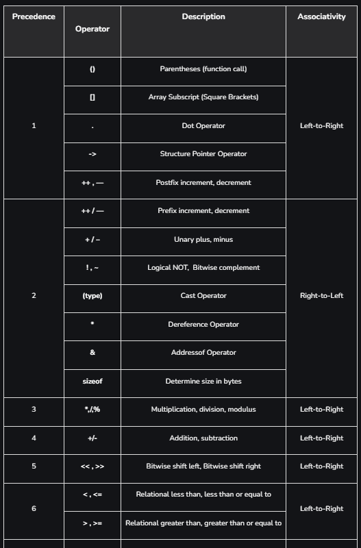
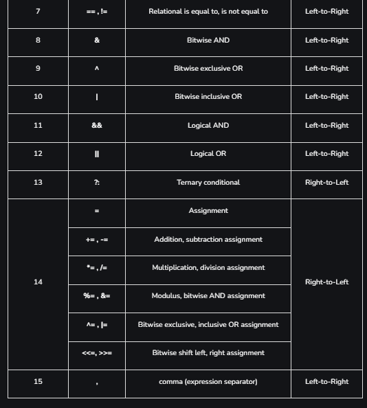

## Operator Precedence and Associativity in C

The concept of operator precedence and associativity in C helps in determining which operators will be given priority when there are multiple operators in the expression. It is very common to have multiple operators in C language and the compiler first evaluates the operator with higher precedence. It helps to maintain the ambiguity of the expression and helps us in avoiding unnecessary use of parenthesis.

**NOTE**: *In programming language theory, the `associativity` of an operator is a property that determines how operators of the same precedence are grouped in the absence of parentheses.*

## Operator Precedence and Associativity Table

The following tables list the C operator precedence from highest to lowest and the associativity for each of the operators:

Easy Trick to Remember the Operators Associativity and Precedence: **PUMA'S REBL TAC**

where, P = Postfix, U = Unary, M = Multiplicative, A = Additive, S = Shift, R = Relational, E = Equality, B = Bitwise, L = Logical, T = Ternary, A = Assignment and C = Comma
