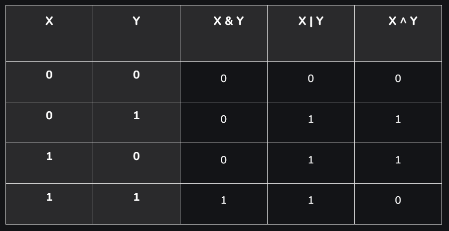

## Bitwise Operators in C

In C, the following 6 operators are bitwise operators (also known as bit operators as they work at the bit-level). They are used to perform bitwise operations in C.

1. The `&` (bitwise AND) in C takes two numbers as operands and does AND on every bit of two numbers. The result of AND is 1 only if both bits are 1.  

2. The `|` (bitwise OR) in C takes two numbers as operands and does OR on every bit of two numbers. The result of OR is 1 if any of the two bits is 1.

3. The `^` (bitwise XOR) in C takes two numbers as operands and does XOR on every bit of two numbers. The result of XOR is 1 if the two bits are different.

4. The `<<` (left shift) in C takes two numbers, left shifts the bits of the first operand, and the second operand decides the number of places to shift. 

5. The `>>` (right shift) in C takes two numbers, right shifts the bits of the first operand, and the second operand decides the number of places to shift.

6. The `~` (bitwise NOT) in C takes one number and inverts all bits of it.

Let’s look at the truth table of the bitwise operators.



```c
#include <stdio.h>

int main()
{

    // a = 5(00000101) b = 9(00001001)
    unsigned int a = 5, b = 9;

    printf("a = %u, b = %u\n", a, b);

    printf("a & b is %u\n", a & b); // 00000001 or 1 in decimal

    printf("a | b is %u\n", a | b); // 000001101 or 13

    printf("a ^ b is %u\n", a ^ b); // 000001100 or 12

    printf("~a is %u, ~b is %u\n", ~a, ~b);
    // a is 11111111111111111111111111111010 or 4294967290 in decimal
    // b is 11111111111111111111111111110110 or 4294967286 in decimal - make integer formatter signed - see what happens

    printf("a << b is %u\n", a << b); // 00000000000000000000101000000000 or 2560 in decimal form

    printf("a >> b is %u\n", a >> b); // 0

    return 0;
}
```

Output
```bash
a = 5, b = 9
a & b is 1
a | b is 13
a ^ b is 12
~a is 4294967290, ~b is 4294967286
a << b is 2560
a >> b is 0
```

## Interesting facts about bitwise operators

1. The left-shift and right-shift operators should not be used for negative numbers.

If the second operand(which decides the number of shifts) is a negative number, it results in undefined behavior in C. For example, results of both 1 <<- 1 and 1 >> -1 are undefined. Also, if the number is shifted more than the size of the integer, the behavior is undefined. For example, 1 << 33 is undefined if integers are stored using 32 bits. Another thing is NO shift operation is performed if the additive expression (operand that decides no of shifts) is 0. For example, 5 << 0 is just 5.

2. The bitwise OR of two numbers is just the sum of those two numbers if there is no carry involved, otherwise, you just add their bitwise AND and OR.

Let’s say, we have a=5(101) and b=2(010), since there is no carry involved, their sum is just a|b. Now, if we change 'a' to 6 which is 110 in binary, their sum would change to a|b + a&b since there is a carry involved.

```
#include <stdio.h>

int main()
{

    int a = 5, b = 2;
    printf("a + b is %d\n", a + b); // 7
    printf("a | b is %d\n", a | b); // 7

    return 0;
}
```

Output
```bash
a + b is 7
a | b is 7
```

```c
#include <stdio.h>

int main()
{

    int a = 6, b = 2;
    printf("a + b is %d\n", a + b); // 8
    printf("a | b is %d\n", a | b); // 6
    printf("a & b is %d\n", a & b); // 2

    return 0;
}
```

Output
```bash
a + b is 8
a | b is 6
a & b is 2
```

3. The bitwise XOR operator is very useful

It is used in many problems. A simple example could be “Given a set of numbers where all elements occur an even number of times except one number, find the odd occurring number” This problem can be efficiently solved by doing XOR to all numbers. 

```c
#include <stdio.h>

int findOdd(int arr[], int n)
{
    int res = 0, i;
    for (i = 0; i < n; i++)
    {
        res ^= arr[i];
        printf("res is %d\n", res);
    }
    return res;
}

int main()
{

    int arr[] = {12, 12, 14, 90, 14, 14, 14};
    int n = sizeof(arr) / sizeof(arr[0]); // this is how you find length of an array by the way
    printf("The odd occurring element is %d\n",
           findOdd(arr, n));
    return 0;
}
```

Output
```bash
res is 12
res is 0
res is 14
res is 84
res is 90
res is 84
res is 90
The odd occurring element is 90
```

4. The Bitwise operators should not be used in place of logical operators.

The result of logical operators (&&, || and !) is either 0 or 1, but bitwise operators return an integer value. Also, the logical operators consider any non-zero operand as 1. For example, consider the following program, the results of & and && are different for the same operands. 

```c
#include <stdio.h>

int main()
{
    int x = 2, y = 5;
    (x & y) ? printf("True ") : printf("False "); // 00101 & 00010 = 00000
    (x && y) ? printf("True ") : printf("False ");
    return 0;
}
```

Output
```bash
False True
```

5. The left-shift and right-shift operators are equivalent to multiplication and division by 2 respectively.

As mentioned in point 1, it works only if numbers are positive.

```c
#include <stdio.h>

int main()
{
    int x = 19;

    printf("x << 1 = %d\n", x << 1); // x << 2 would be equivalent to x * 4 and so on
    printf("x >> 1 = %d\n", x >> 1); // works the same for the right-shift

    return 0;
}
```

6. The & operator can be used to quickly check if a number is odd or even.

The value of the expression (x & 1) would be non-zero only if x is odd, otherwise, the value would be zero, because odd numbers have 1 in the end of their binary form, and even numbers have 0 on the end.

```c
#include <stdio.h>

int main()
{
    int x = 19;

    (x & 1) ? printf("Odd") : printf("Even");

    return 0;
}
```

Output
```bash
Odd
```

7. The ~ operator should be used carefully.

The result of the ~ operator on a small number can be a big number if the result is stored in an unsigned variable. The result may be a negative number if the result is stored in a signed variable (assuming that the negative numbers are stored in 2’s complement form where the leftmost bit is the sign bit).

```c
#include <stdio.h>

int main()
{
    unsigned int x = 1;
    printf("Signed result %d\n", ~x);
    printf("Unsigned result %u\n", ~x);
    return 0;
}
```

Output
```bash
Signed result -2
Unsigned result 4294967294
```

*NOTE*: *The output of the above program is compiler-dependent*