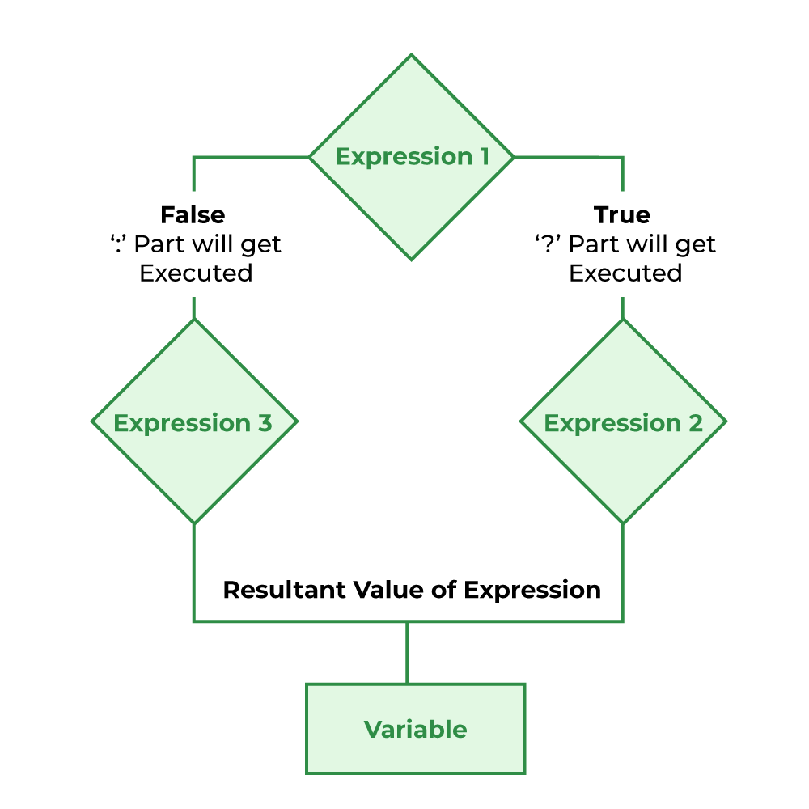

## Conditional or Ternary Operator (`?:`) in C

The conditional operator in C is kind of similar to the if-else statement as it follows the same algorithm as of if-else statement but the conditional operator takes less space and helps to write the if-else statements in the shortest way possible. It is also known as the ternary operator in C as it operates on three operands.

## Syntax of Conditional/Ternary Operator in C

The conditional operator can be in the form

```c
variable = Expression1 ? Expression2 : Expression3;
```

Or the syntax can also be written in this form

```c
variable = (condition) ? Expression2 : Expression3;
```

Or the syntax can also be written in this form

```c
(condition) ? (variable = Expression2) : (variable = Expression3);
```


It can be visualized into an if-else statement as:
```c
if (Expression1) {
    variable = Expression2;
}
else {
    variable = Expression3;
}
```

Since the Conditional Operator `?:` takes three operands to work, hence it is also called **ternary operator**.

**NOTE**: *The ternary operator has third most lowest precedence, so we need to use the expressions such that we can avoid errors due to improper operator precedence management.*

## Working of Conditional/Ternary Operator in C

The working of the conditional operator in C is as follows:

- **Step 1**: `Expression1` is the condition to be evaluated

- **Step 2A**: If the condition(`Expression1`) is True then `Expression2` will be executed

- **Step 2B**: If the condition(`Expression1`) is False then `Expression3` will be executed

- **Step 3**: Results will be returned

## Flowchart of Conditional/Ternary Operator in C

To understand the working better, we can analyze the flowchart of the conditional operator given below.



## Examples of C Ternary Operator

### Example 1: C Program to Store the greatest of the two Numbers using the ternary operator

```c
#include <stdio.h>

int main()
{

    int number1, number2;

    printf("Enter the first number: ");
    scanf(" %d", &number1);

    printf("Enter the second number: ");
    scanf(" %d", &number2);

    int greatest = (number1 > number2) ? number1 : number2;

    printf("%d is the greatest of the numbers: %d and %d\n", greatest, number1, number2);

    return 0;
}
```

Output
```
Enter the first number: 45
Enter the second number: 77
77 is the greatest of the numbers: 45 and 77
```

OR

```c
#include <stdio.h>

int main()
{
    int m = 5, n = 4;

    (m > n) ? printf("m is greater than n, that is %d > %d\n", m, n)
            : printf("n is greater than m, that is %d > %d", n, m);

    return 0;
}
```

Output
```
m is greater than n, that is 5 > 4
```

### Example 2: C Program to check whether a year is a leap year using ternary operator

```c
#include <stdbool.h>
#include <stdio.h>

void is_leap(int year)
{
    (year % 4 == 0) ? (year % 100 != 0 ? printf("%d is a leap year\n", year)
                                       : (year % 400 == 0 ? printf("%d is a leap year\n", year)
                                                          : printf("%d is not a leap year\n", year)))
                    : printf("%d is not a leap year\n", year);
}

int main()
{
    int year;

    while (true)
    {
        printf("Enter a year: ");
        scanf(" %d", &year);
        is_leap(year);
    }

    return 0;
}
```

Output
```
Enter a year: 2016
2016 is a leap year
Enter a year: 2015
2015 is not a leap year
Enter a year: 1800
1800 is not a leap year
Enter a year: 800
800 is a leap year
Enter a year: 1600
1600 is a leap year
```

## Conclusion

The conditional operator or ternary operator in C is generally used when we need a short conditional code such as assigning value to a variable based on the condition. It can be used in bigger conditions but it will make the program very complex and unreadable.