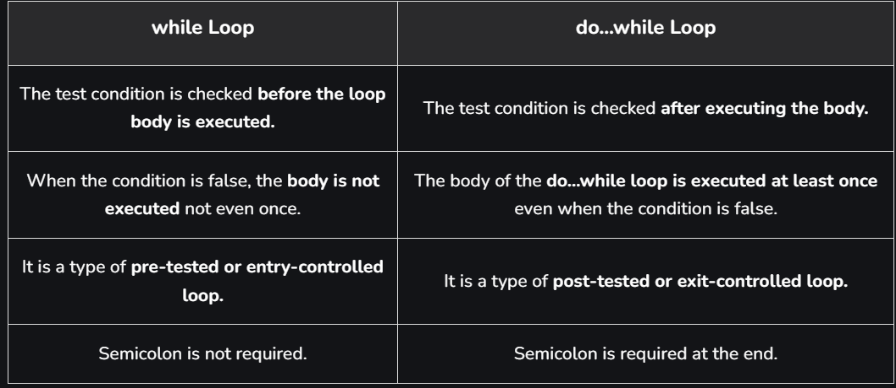

# do...while Loop in C

The do...while in C is a loop statement used to repeat some part of the code till the given condition is fulfilled. It is a form of an **exit-controlled** or **post-tested** loop where the test condition is checked after executing the body of the loop. Due to this, the statements in the do…while loop will always be executed at least once no matter what the condition is.

## Syntax

```c
do {
 
    // body of do-while loop    
    
} while (condition);
```

```c
#include <stdio.h>

int main()
{

    int var = 0;

    do
    {
        printf("Hello World\n");
        var++;
    } while (var < 3);

    return 0;
}
```

Output

```bash
Hello World
Hello World
Hello World
```

## The working of the do...while loop

1. When the program control first comes to the do...while loop, the body of the loop is executed first and then the test condition/expression is checked, unlike other loops where the test condition is checked first. Due to this property, the do…while loop is also called exit controlled or post-tested loop.

2. When the test condition is evaluated as true, the program control goes to the start of the loop and the body is executed once more.

3. The above process repeats till the test condition is true.

4. When the test condition is evaluated as false, the program control moves on to the next statements after the do...while loop.

As with the while loop in C, initialization and updation is not a part of the do...while loop syntax. We have to do that explicitly before and in the loop respectively.

## Nested do...while loop in C

```c
#include <stdio.h>

int main()
{

    int i = 0, j = 0, counter = 0;

    do
    {
        do
        {
            printf("%d ", counter++);
            j++;
        } while (j < 3);

        printf("\n");
        i++;
        j = 0;

    } while (i < 3);

    return 0;
}
```

Output

```bash
0 1 2
3 4 5
6 7 8
```

## Examples of do...while loop in C

### Example 1

```c
#include <stdbool.h>
#include <stdio.h>

int main()
{

    bool condition = false;

    do
    {
        printf("This will be printed once\n");
    } while (condition);

    return 0;
}
```

Output

```bash
This will be printed once
```

### Example 2

```c
#include <stdio.h>

int main()
{

    int N, i = 0;
    printf("Enter a number: ");
    scanf(" %d", &N);

    do
    {
        printf("%d\t*\t%d\t=\t%d\n", N, i, i * N);
    } while (i++ <= 9);

    return 0;
}
```

Output

```bash
Enter a number: 5
5       *       0       =       0
5       *       1       =       5
5       *       2       =       10
5       *       3       =       15
5       *       4       =       20
5       *       5       =       25
5       *       6       =       30
5       *       7       =       35
5       *       8       =       40
5       *       9       =       45
5       *       10      =       5
```

## Differences between `while` and `do...while` Loops in C



In conclusion, the use of the only exit-controlled loop in C, the do...while loop is also to iterate a particular part of code but the way it works makes it different from entry-controlled loops such as the while loop and the for loop. It is useful in cases where we need to execute the statement inside the loop body at least once such as in traversing circular linked lists.
