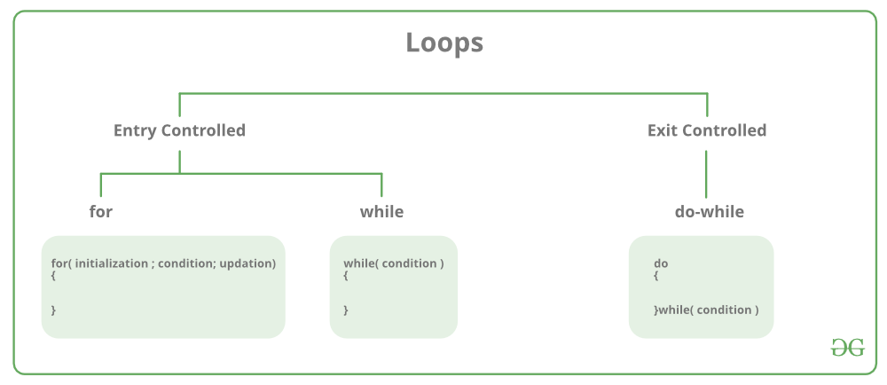

# C - Loops

Loops in programming are used to repeat a block of code until the specified condition is met. A loop statement allows programmers to execute a statement or group of statements multiple times without repetition of code.

There are mainly 2 types of loops in C Programming:

1. **Entry Controlled Loops**: In Entry controlled loops the test condition is checked before entering the main body of the loop. **For Loop** and **While Loop** are entry-controlled loops.

2. **Exit Controlled Loops**:  In Exit controlled loops the test condition is evaluated at the end of the loop body. The loop body will execute at least once, irrespective of whether the condition is true or false. **do-while Loop** is Exit Controlled loop.



`for-loop`: first Initializes, then condition check, then executes the body and at last, the update is done.

```c
#include <stdio.h>

int main()
{
    int a;

    for (int i = 0; i < 3; i++)
    {
        a = i;
        break;
    }

    printf("%d", a);do-while first executes the body and then the condition check is done.

    return 0;
}
```

Output

```bash
0
```

`while-loop`: first Initializes, then condition checks, and then executes the body, and updating can be inside the body.

`do-while loop`: do-while first executes the body and then the condition check is done.

## for-loop

for loop in C programming is a repetition control structure that allows programmers to write a loop that will be executed a specific number of times. for loop enables programmers to perform n number of steps together in a single line.

Syntax

```c
for (initialize expression; test expression; update expression)
{
    //
    // body of for loop
    //
}
```

Example

```c
for(int i = 0; i < n; ++i)
{
    printf("Body of for loop which will execute till n");
}
```

In for loop, a loop variable is used to control the loop. Firstly we initialize the loop variable with some value, then check its test condition. If the statement is true then control will move to the body and the body of for loop will be executed. Steps will be repeated till the exit condition becomes true. If the test condition will be false then it will stop.

- **Initialization Expression**: In this expression, we assign a loop variable or loop counter to some value. for example: int i=1

- **Test Expression**: In this expression, test conditions are performed. If the condition evaluates to true then the loop body will be executed and then an update of the loop variable is done. If the test expression becomes false then the control will exit from the loop. for example, i<=9

- **Update Expression**: After execution of the loop body loop variable is updated by some value, it could be incremented, decremented, multiplied, or divided by any value.

```c
#include <stdio.h>

int main()
{

    for (int i = 1; i <= 10; i++)
    {
        printf("Hello World\n");
    }
}
```

```bash
Hello World
Hello World
Hello World
Hello World
Hello World
Hello World
Hello World
Hello World
Hello World
Hello World
```

## while loop

While loop does not depend upon the number of iterations. In for loop the number of iterations was previously known to us but in the While loop, the execution is terminated on the basis of the test condition. If the test condition will become false then it will break from the while loop else body will be executed.

Syntax

```c
initialization_expression;

while (test_expression)
{
    // body of the while loop
    
    update_expression;
}
```

```c
#include <stdio.h>

int main()
{

    int i = 2;

    while (i < 10)
    {
        printf("Hello World\n");
        i++;
    }
}
```

Output

```bash
Hello World
Hello World
Hello World
Hello World
Hello World
Hello World
Hello World
Hello World
```

## do-while loop

The do-while loop is similar to a while loop but the only difference lies in the do-while loop test condition which is tested at the end of the body. In the do-while loop, the loop body will execute at least once irrespective of the test condition.

Syntax

```c
initialization_expression;
do
{
    // body of do-while loop
    
    
    update_expression;

} while (test_expression);
```

```c
#include <stdio.h>

int main()
{

    int i = 2;

    do
    {
        printf("Hello World\n");
    } while (i < 1);

    return 0;
}
```

Output

```bash
Hello World
```

## Loop Control Statements

- `break` statement: the break statement is used to terminate the switch and loop statement. It transfers the execution to the statement immediately following the loop or switch

- `continue` statement: continue statement skips the remainder body and immediately resets its condition before reiterating it

- `goto` statement: goto statement transfers the control to the labeled statement

## Infinite Loop

An infinite loop is executed when the test expression never becomes false and the body of the loop is executed repeatedly. A program is stuck in an Infinite loop when the condition is always true. Mostly this is an error that can be resolved by using Loop Control statements.

### Using for loop

```c
#include <stdio.h>

int main()
{

    for (;;)
    {
        printf("This line will be printed to the end of times...\n");
    }

    return 0;
}
```

Output

```bash
This line will be printed to the end of times...
This line will be printed to the end of times...
This line will be printed to the end of times...
This line will be printed to the end of times...
This line will be printed to the end of times...
This line will be printed to the end of times...
This line will be printed to the end of times...
This line will be printed to the end of times...
This line will be printed to the end of times...
...
```

## Using While Loop

```c
#include <stdio.h>
#include <stdbool.h>

int main()
{

    while (true)
    {
        printf("This line will be printed till the end of times...\n");
    }

    return 0;
}
```

Output

```bash
This line will be printed till the end of times...
This line will be printed till the end of times...
This line will be printed till the end of times...
This line will be printed till the end of times...
This line will be printed till the end of times...
This line will be printed till the end of times...
This line will be printed till the end of times...
This line will be printed till the end of times...
This line will be printed till the end of times...
This line will be printed till the end of times...
This line will be printed till the end of times...
This line will be printed till the end of times...
...
```

## Using do-while loop

```c
#include <stdbool.h>
#include <stdio.h>

int main()
{

    do
    {
        printf("This loop will run forever...\n");
    } while (true);

    return 0;
}
```

Output

```bash
This loop will run forever...
This loop will run forever...
This loop will run forever...
This loop will run forever...
This loop will run forever...
This loop will run forever...
This loop will run forever...
This loop will run forever...
This loop will run forever...
This loop will run forever...
...
```
