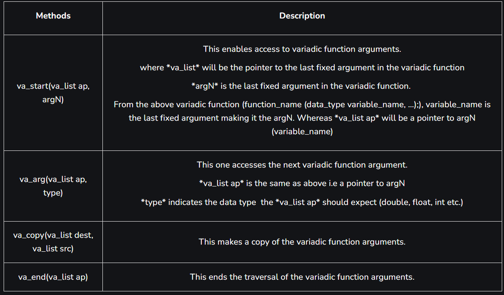

# Variadic Functions in C

Variadic functions are functions that can take a variable number of arguments. In C programming, a variadic function adds flexibility to the program. It takes one fixed argument and then any number of arguments can be passed. The variadic function consists of at least one fixed variable and then an ellipsis(…) as the last parameter.

Syntax:

```c
int function_name(int var, ...);
```

Values of the passed arguments can be accessed through the header file named as:

```c
#include <stdarg.h>
```

`<stdarg.h>` includes the following methods:



Here, **va_list** holds the information needed by **va_start**, **va_arg**, **va_end**, and **va_copy**.

Example 1

The following simple C program will demonstrate the working of the variadic function `addNumbers()`:

```c
#include <stdarg.h>
#include <stdio.h>

int addNumbers(int n, ...)
{
    int sum = 0;
    va_list ptr;
    va_start(ptr, n);
    for (int i = 0; i < n; i++)
    {
        sum += va_arg(ptr, int);
    }
    va_end(ptr);
    return sum;
}

int main(void)
{
    printf("Variadic function use:\n");
    printf("1. 100 + 54 + 1 = %d\n", addNumbers(3, 100, 54, 1));
    printf("2. 33 + 81 + 98 + 7 + 44 = %d\n", addNumbers(5, 33, 81, 98, 7, 44));
    printf("3. 63 + 9 = %d\n", addNumbers(2, 63, 9));
    return 0;
}
```

Output

```bash
Variadic function use:
1. 100 + 54 + 1 = 155
2. 33 + 81 + 98 + 7 + 44 = 263
3. 63 + 9 = 72
```

Example 2

Below is the C program consisting of the variadic function `largestNumber()`:

```c
#include <stdarg.h>
#include <stdio.h>

int largestNumber(int n, ...)
{

    va_list ptr;

    va_start(ptr, n);

    int largest = va_arg(ptr, int);

    for (int i = 0; i < n - 1; i++)
    {
        int temp = va_arg(ptr, int);
        largest = temp > largest ? temp : largest;
    }

    va_end(ptr);

    return largest;
}

int main(void)
{

    printf("The largest number out of (123, 99, 7, 50, 608) is %d\n", largestNumber(5, 123, 99, 7, 50, 608));

    return 0;
}
```

```bash
The largest number out of (123, 99, 7, 50, 608) is 608
```

**IMPORTANT:** *Come back to this when you understand pointers.*
