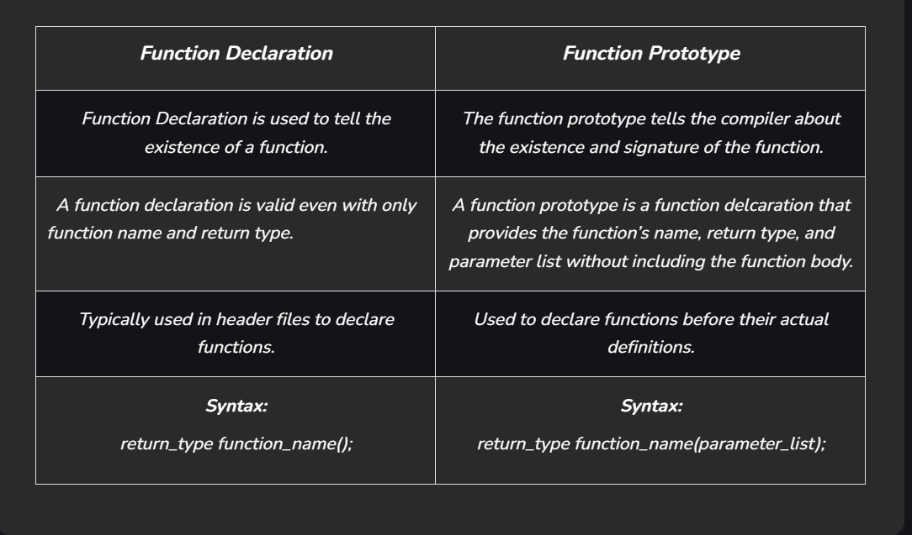

# Function Prototype in C

The C function prototype is a statement that tells the compiler about the function’s name, its return type, numbers and data types of its parameters. By using this information, the compiler cross-checks function parameters and their data type with function definition and function call.

Function prototype works like a function declaration where it is necessary where the function reference or call is present before the function definition but optional if the function definition is present before the function call in the program.

```c
return_type function_name(parameter_list);
```

where:

- **return_type**: It is the data type of the value that the function returns. It can be any data type int, float, void, etc. If the function does not return anything, void is used as the return type.

- **function_name**: It is the identifier of the function. Use appropriate names for the functions that specify the purpose of the function.

- **parameter_list**: It is the list of parameters that a function expects in parentheses. A parameter consists of its data type and name. If we don’t want to pass any parameter, we can leave the parentheses empty.

For example

```c
int func(int, char, char *, float);
```

Example of C program that uses function prototype

```c
#include <stdio.h>

// Function Prototype
float calculateRectangleArea(float width, float length);

int main(void)
{
    float width = 2.5, length = 5.7;
    printf("The area of the rectangle with width of %.2f and length of %.2f is %.2f\n", width, length, calculateRectangleArea(width, length));
    return 0;
}

// Function Definition
float calculateRectangleArea(float width, float length)
{
    return width * length;
}

```

Output

```bash
The area of the rectangle with width of 2.50 and length of 5.70 is 14.25
```

## What if the function prototype is not specified?

If we ignore the function prototype, a program may compile with a warning, it may give errors and may work properly. But sometimes, it will give strange output and it is very hard to find such programming mistakes.

Trying to compile the function from the previous example without function prototype, the output is this and the executable is not compiled:

```bash
[admin@localhost ~] gcc -Wall ./test.c
.\test.c: In function 'main':
.\test.c:9:104: warning: implicit declaration of function 'calculateRectangleArea' [-Wimplicit-function-declaration]
     printf("The area of the rectangle with width of %.2f and length of %.2f is %.2f\n", width, length, calculateRectangleArea(
width, length));
                                                                                                        ^~~~~~~~~~~~~~~~~~~~~~
.\test.c:9:83: warning: format '%f' expects argument of type 'double', but argument 4 has type 'int' [-Wformat=]
     printf("The area of the rectangle with width of %.2f and length of %.2f is %.2f\n", width, length, calculateRectangleArea(
width, length));
                                                                                   ^
.\test.c: At top level:
.\test.c:13:7: error: conflicting types for 'calculateRectangleArea'
 float calculateRectangleArea(float width, float length)
       ^~~~~~~~~~~~~~~~~~~~~~
.\test.c:9:104: note: previous implicit declaration of 'calculateRectangleArea' was here
     printf("The area of the rectangle with width of %.2f and length of %.2f is %.2f\n", width, length, calculateRectangleArea(
width, length));
                                                                                                        ^~~~~~~~~~~~~~~~~~~~~~
PS D:\c_training_1> .\a.exe
The area of the rectangle with width of 2.50 and length of 5.70 is 14.25
PS D:\c_training_1> python .\cleanup.py
Executable file: ./a.exe was removed
PS D:\c_training_1> gcc -Wall .\test.c
.\test.c: In function 'main':
.\test.c:9:104: warning: implicit declaration of function 'calculateRectangleArea' [-Wimplicit-function-declaration]
     printf("The area of the rectangle with width of %.2f and length of %.2f is %.2f\n", width, length, calculateRectangleArea(
width, length));
                                                                                                        ^~~~~~~~~~~~~~~~~~~~~~
.\test.c:9:83: warning: format '%f' expects argument of type 'double', but argument 4 has type 'int' [-Wformat=]
     printf("The area of the rectangle with width of %.2f and length of %.2f is %.2f\n", width, length, calculateRectangleArea(
width, length));
                                                                                   ^
.\test.c: At top level:
.\test.c:13:7: error: conflicting types for 'calculateRectangleArea'
 float calculateRectangleArea(float width, float length)
       ^~~~~~~~~~~~~~~~~~~~~~
.\test.c:9:104: note: previous implicit declaration of 'calculateRectangleArea' was here
     printf("The area of the rectangle with width of %.2f and length of %.2f is %.2f\n", width, length, calculateRectangleArea(
width, length));
              
```

## The difference between function declaration and function prototype



**NOTE:** *All prototypes are declarations, but not all declarations are prototypes.*

**NOTE:** *The function name and the parameter list together constitute the function signature.*
